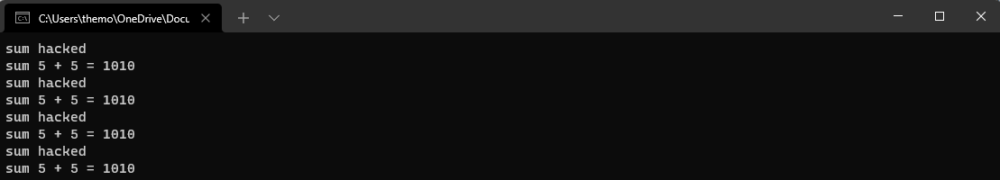
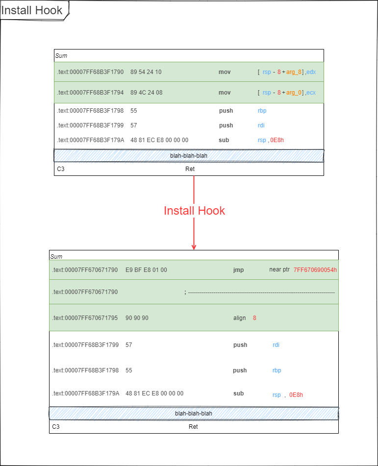

# X64 Function Hooking

Un hook permet à l'utilisateur d'un logiciel de personnaliser le fonctionnement de ce dernier, en lui faisant réaliser des
actions supplémentaires à des moments déterminés. Le concepteur du logiciel prévoit des hooks tout au long du fonctionnement
de son programme, qui sont des points d'entrée vers des listes d'actions. Par défaut, le hook est généralement vide et seules
les fonctionnalités de base de l'application sont exécutées. Cependant, l'utilisateur peut « accrocher » des morceaux de programme
à ces hooks pour personnaliser le logiciel.

## Sommaire

- Introduction
- Qu'est-ce que une fonction d'accrochage ?
- Comment ça marche ?
- Références

## Introduction

J'ai passé un peu de temps récemment à comprendre comment fonctionnait le hooking. Il existe des tonnes
d'excellentes ressources disponibles à ce sujet, mais j'ai remarqué que beaucoup d'entre elles sont vraiment
légères sur la fourniture d'exemples de code, et celles qui fournissent du code ont tendance à être liées à des
frameworks de hooking entièrement matures. Habituellement, les projets liés sont vraiment impressionnants, mais
ce ne sont pas les endroits les plus faciles pour apprendre les bases.

Maintenant que j'en sais assez, il m'a semblé amusant de rectifier ce manque d'exemple de code en créant du code
d'accrochage à partir de zéro et en expliquant comment utiliser ce code pour accrocher un programme en cours d'exécution.



## Qu'est-ce que l'accrochage des fonctions ?

L'accrochage de fonction est une technique de programmation qui vous permet d'intercepter et de rediriger les appels de fonction
dans une application en cours d'exécution, ce qui vous permet de modifier le comportement d'exécution de ce programme d'une manière
qui n'était peut-être pas prévue lors de la compilation initiale du programme.

> C'est un peu comme quand un chien monte dans une voiture en pensant qu'il va au parc et finit chez le vétérinaire à la place.
Le chien a appelé goToPark(), mais s'est retrouvé de manière inattendue dans goToVet() à la place. Cet exemple n'est pas génial.

Le vrai plaisir de l'accrochage de fonctions est que vous pouvez l'utiliser pour modifier le comportement de programmes dont vous
n'avez pas le code source ou que vous ne pouvez pas recompiler. Combiné avec l'injection de processus, vous pouvez utiliser des
crochets de fonction pour ajouter un comportement entièrement nouveau à n'importe quel programme que vous pouvez exécuter sur
votre PC.

Voici d'autres exemples de choses que vous pourriez vouloir faire avec le hooking de fonction :

- Journalisation ou remplacement des arguments de fonction
- Fonctions de désactivation
- Mesurer le temps d'exécution d'une fonction
- Surveillance ou remplacement des données avant qu'elles ne soient envoyées sur un réseau

Les seules limites sont votre imagination et votre capacité à lire l'assemblage !

## Comment ça marche ?

Supposons que nous ayons une fonction qui additionne deux valeurs `sum` et que nous souhaitions utiliser un crochet pour
contourner la logique d'addition et toujours renvoyer l'opérande de gauche (`x`). Le type `uint32_t` est un `unsigned int`
qui utilise un octet pour `x` et `y` respectivement. En additionnant deux d'entre eux, cela pourrait ressembler à ceci :

```c++
uint32_t Sum(int x, int y)
{
  return x + y;
}
```

La fonction par laquelle nous voulons la remplacer (que j'appellerai cette fonction "payload(charge utile)"), ressemble à ceci :

```c++
uint32_t ReturnSum(int x, int y)
{
  return x;
}
```

Si c'était dans votre propre code, vous ajouteriez un appel « `return ReturnSum(x, y)` » au début de `Sum()`, recompilez
et appelez-le un jour, mais que se passe-t-il si vous ne pouvez pas le recompiler ? Par exemple, que se passe-t-il s'il fait partie
d'une bibliothèque tierce à source fermée ou si le programme qui appelle `Sum()` est déjà en cours d'exécution ?

Plutôt que de recompiler, nous pouvons utiliser le hooking pour modifier ses octets d'instruction à la place, et remplacer la première
instruction dans `Sum()` par un `jmp` au début de la fonction `ReturnSum()`. Cela fonctionne même si la fonction que nous voulons accrocher
provient d'une dll système, puisque les segments de code DLL sont copiés sur écriture, il n'y a donc aucune chance qu'un crochet interfère
avec d'autres processus.

Imaginez que la première instruction de `ReturnSum()` soit située `1024` octets après `Sum()` en mémoire. En assemblage, le remplacement
des instructions de `Sum()` par un saut ressemblera à ceci :



L'instruction `jmp` utilisée ici est un saut relatif avec un opérande de 32 bits. L'opcode est `E9`, suivi d'une valeur de 4 octets qui
représente le nombre d'octets à sauter.

Notez qu'après l'instruction jmp, il nous reste des ordures. C'est parce que le processus d'écrasement des 5 premiers octets de `Sum()`
a laissé une instruction partielle dans son sillage. Le premier octet de la deuxième instruction a été écrasé, mais le reste des octets est
toujours là, et qui sait à quelles instructions ils correspondent. Cela laisse le reste de la fonction dans un état inconnu (et probablement
invalide). Cela n'a pas d'importance pour l'exemple, car le programme va sauter à ReturnSum() avant qu'il n'atteigne la poubelle que nous
venons de créer, mais il est important de garder à l'esprit.

Nous écrirons quelques hooks qui préservent la logique originale de la fonction hookée plus tard dans cet article, alors ne vous inquiétez
pas trop pour le moment. Pour notre premier exemple, nous allons construire un programme qui accroche de manière destructive une fonction,
exactement comme ce qui est montré dans le diagramme ci-dessus (avec un peu de sauce supplémentaire pour gérer le code 64 bits).

## Références

- [Hook (informatique)](https://fr.wikipedia.org/wiki/Hook_(informatique))
- [Article original (EN)](http://kylehalladay.com/blog/2020/11/13/Hooking-By-Example.html)
