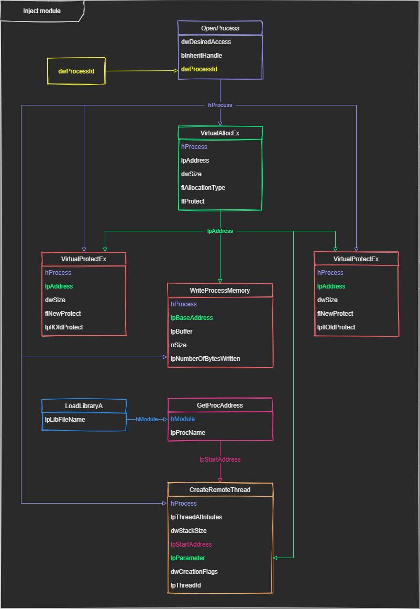

# Injection de DLL

## Sommaire

- Introduction
- Windows
	- Diagramme de classe (Windows)
	- Ouvrez un handle vers le processus cible (Windows)
	- Allouez de la mémoire dans le processus cible (Windows)
	- Créez un nouveau thread dans le processus cible (Windows)
	- Exemple de code (Windows)

## Introduction

Une **injection de DLL** est une technique utilisée pour exécuter du code dans l'espace d'adressage d'un autre processus en
le forçant à charger une bibliothèque de liens dynamiques.

L'**injection de DLL** est souvent utilisée par des programmes externes pour influencer le comportement d'un autre programme d'une manière que
ses auteurs n'avais pas prévue.

Par exemple, le code injecté pourrait [accrocher les appels de fonction](hooking.md) système, ou lire le contenu des zones de texte de mot de passe,
ce qui ne peut pas être fait de la manière habituelle. Un programme utilisé pour injecter du code arbitraire dans des processus arbitraires est appelé
un **injecteur DLL**.

## Windows

Il existe plusieurs façons sur **Windows** de forcer un processus à charger et à exécuter du code d'un DLL, je vais vous en montrée une qui utilise la
fonction `LoadLibraryA` et qui permettra d'injecter un DLL dans un processus en cours d'exécution.


### Diagramme de classe (Windows)



### Ouvrez un handle vers le processus cible (Windows)

Cela peut être fait en engendrant le processus ou en désactivant quelque chose créé par ce processus dont on sait qu'il existe.

Exemple :

- Une fenêtre avec un titre prévisible.
- En obtenant une liste des processus en cours d'exécution.
- En recherchant le nom de fichier de l'exécutable cible.

```c++
#include <TlHelp32.h>

VOID GetProcessEntry32ByName(const char* szProcessName, DWORD th32ProcessID, LPPROCESSENTRY32 lpProcessEntry32)
{
	// Take a snapshot of all processes in the system.
	HANDLE hProcessSnap = CreateToolhelp32Snapshot(TH32CS_SNAPPROCESS, th32ProcessID);
	if (hProcessSnap == INVALID_HANDLE_VALUE)
		printf("[!]CreateToolhelp32Snapshot (of processes)\n");
	else
	{
		PROCESSENTRY32 pe32 { 0 };

		// Set the size of the structure before using it.
		pe32.dwSize = sizeof(PROCESSENTRY32);

		// Retrieve information about the first process
		if (Process32First(hProcessSnap, &pe32) == 0)
			printf("[!]Failed to gather information on system processes!\n");	// show cause of failure
		else
		{
			// Now walk the snapshot of processes
			do
			{
				if (strcmp(szProcessName, pe32.szExeFile) == 0)
				{
					memcpy(lpProcessEntry32, &pe32, pe32.dwSize);
					break;
				}
			}
			while (Process32Next(hProcessSnap, &pe32));
		}

		CloseHandle(hProcessSnap);
	}
}
```

### Allouez de la mémoire dans le processus cible (Windows)

Allouez le nom de la DLL à injecter dans la mémoire du processus cible.

> Cette étape peut être ignorée si un nom de DLL approprié est déjà disponible dans le processus cible. Par exemple, si un processus est lié à `User32.dll`,
`GDI32.dll`, `Kernel32.dll` ou toute autre bibliothèque dont le nom se termine par `32.dll`, il serait possible de charger une bibliothèque nommée `32.dll`.
Cette technique s'est révélée efficace dans le passé contre une méthode de protection des processus contre l'`injection de DLL`.

### Créez un nouveau thread dans le processus cible (Windows)

Créez un nouveau thread dans le processus cible avec l'adresse de démarrage du thread définie sur l'adresse de **LoadLibrary** et l'argument défini sur
l'adresse de la chaîne qui vient d'être téléchargée dans la cible. Au lieu d'écrire le nom d'une DLL à charger sur la cible et de démarrer le nouveau thread
sur LoadLibrary, on peut écrire le code à exécuter sur la cible et démarrer le thread sur ce code.

> Notez que sans précautions, cette approche peut être détectée par le processus cible en raison des notifications `DLL_THREAD_ATTACH` envoyées à chaque module
chargé au démarrage d'un thread.

### Exemple de code (Windows)

L'exemple de fonction ci-dessous utilise une méthode d'**injection de DLL** qui exploite le fait que `kernel32.dll` est mappé à la même adresse dans presque
tous les processus. Par conséquent, `LoadLibrary` (qui est une fonction de `kernel32.dll`) est également mappé à la même adresse. `LoadLibrary` correspond
également à la routine de démarrage de thread requise par `CreateRemoteThread`.

```c++
#include <Windows.h>
#include <TlHelp32.h>
#include <stdio.h>
#include <stdlib.h>

VOID GetProcessEntry32ByName(const char* szProcessName, DWORD th32ProcessID, LPPROCESSENTRY32 lpProcessEntry32)
{
	// Take a snapshot of all processes in the system.
	HANDLE hProcessSnap = CreateToolhelp32Snapshot(TH32CS_SNAPPROCESS, th32ProcessID);
	if (hProcessSnap == INVALID_HANDLE_VALUE)
		printf("[!]CreateToolhelp32Snapshot (of processes)\n");
	else
	{
		PROCESSENTRY32 pe32 { 0 };

		// Set the size of the structure before using it.
		pe32.dwSize = sizeof(PROCESSENTRY32);

		// Retrieve information about the first process
		if (Process32First(hProcessSnap, &pe32) == 0)
			printf("[!]Failed to gather information on system processes!\n");	// show cause of failure
		else
		{
			// Now walk the snapshot of processes
			do
			{
				if (strcmp(szProcessName, pe32.szExeFile) == 0)
				{
					memcpy(lpProcessEntry32, &pe32, pe32.dwSize);
					break;
				}
			}
			while (Process32Next(hProcessSnap, &pe32));
		}

		CloseHandle(hProcessSnap);
	}
}

HANDLE GetHandleByProcessId(DWORD processId)
{
	printf("[+]Opening process by process id (0x%08x).\n\n", processId);

	// Retrieving a handle to the target process.
	HANDLE hProcess = OpenProcess(
		PROCESS_ALL_ACCESS, // The access to the process object.
		FALSE,				// Processes do not inherit this handle.
		processId			// The identifier of the local process to be opened.
	);

	if (hProcess == nullptr)
	{
		printf("[!]OpenProcess failed with error (%d).\n", GetLastError());
		return FALSE;
	}

	printf("[+]Succesfully open handle (0x08%p).\n\n", hProcess);
	return hProcess;
}

LPVOID GetAllocAndWriteMemory(HANDLE hProcess, const char* filename)
{
	size_t dwFilepathSize = strlen(filename) + 1;

	// Allocating memory in the target process
	printf("[+]Reserve memory in the virtual address space of the target process.\n");
	LPVOID pDllFilenameAllocAddr = VirtualAllocEx(
		hProcess,					// The function allocates memory within the virtual address space of this process.
		nullptr,					// The pointer that specifies a desired starting address for the region of pages that you want to allocate.
		dwFilepathSize,				// The size of the region of memory to allocate, in bytes.
		MEM_COMMIT | MEM_RESERVE,	// The type of memory allocation.
		PAGE_READWRITE				// The memory protection for the region of pages to be allocated.
	);
	if (pDllFilenameAllocAddr == nullptr)
	{
		printf("[!]VirtualAllocEx failed with error (%d).\n", GetLastError());
		return nullptr;
	}
	printf("[+]Succesfully reserve memory in the virtual address space of the target process.\n\n");


	printf("[+]Unprotect virtual memory for target process handle.\n");
	DWORD lpflOldProtect = 0; // A pointer to a variable that receives the previous access protection of the first page in the specified region of pages.
	BOOL success = VirtualProtectEx(
		hProcess,				// A handle to the process whose memory protection is to be changed.
		pDllFilenameAllocAddr,	// A pointer to the base address of the region of pages whose access protection attributes are to be changed.
		dwFilepathSize,			// The size of the region whose access protection attributes are changed, in bytes.
		PAGE_EXECUTE_READWRITE,	// The memory protection option.
		&lpflOldProtect
	);
	if (!success)
	{
		printf("[!]VirtualProtectEx failed with error (%d).\n", GetLastError());
		return nullptr;
	}
	printf("[+]Succesfully set virtual protect (0x%08x).\n", lpflOldProtect);

	// Writing the dll path into that memory.
	printf("\t[+]Writes module filename to an area of memory in a target process.\n");
	SIZE_T lpNumberOfBytesWritten;
	success = WriteProcessMemory(
		hProcess,				// A handle to the process memory to be modified.
		pDllFilenameAllocAddr,	// A pointer to the base address in the specified process to which data is written.
		filename,				// A pointer to the buffer that contains data to be written in the address space of the specified process.
		dwFilepathSize,			// The number of bytes to be written to the specified process.
		&lpNumberOfBytesWritten	// A pointer to a variable that receives the number of bytes transferred into the specified process.
	);
	if (!success)
	{
		printf("\t[!]WriteProcessMemory failed with error (%d).\n", GetLastError());
		return nullptr;
	}
	else if (lpNumberOfBytesWritten != dwFilepathSize)
	{
		printf("\t[!]WriteProcessMemory failed not set total length.\n");
		return nullptr;
	}
	printf("\t[+]Succesfully write memory in handle process.\n");

	// Reset VirtualProtectEx
	printf("\t[+]Reset protect virtual memory for target process handle.\n");
	success = VirtualProtectEx(
		hProcess,				// A handle to the process whose memory protection is to be changed.
		pDllFilenameAllocAddr,	// A pointer to the base address of the region of pages whose access protection attributes are to be changed.
		dwFilepathSize,			// The size of the region whose access protection attributes are changed, in bytes.
		lpflOldProtect,			// [Reset] The memory protection option.
		&lpflOldProtect
	);
	if (!success)
	{
		printf("[!]VirtualProtectEx failed with error (%d).\n", GetLastError());
		return nullptr;
	}
	printf("[+]Succesfully reset virtual protect (0x%08x).\n\n", lpflOldProtect);

	return pDllFilenameAllocAddr;
}

LPTHREAD_START_ROUTINE GetLoadLibraryAddress()
{
	// GetProcAddress
	HMODULE hModuleKernel32 = LoadLibrary("kernel32");
	if (hModuleKernel32 == 0)
	{
		printf("[!]Failed to load module kernel32\n");
		return FALSE;
	}
	// Getting LoadLibraryA address (same across all processes) to start execution at it
	return (LPTHREAD_START_ROUTINE)GetProcAddress(hModuleKernel32, "LoadLibraryA");
}

BOOL CreateRemoteThread(HANDLE hProcess, LPTHREAD_START_ROUTINE loadLibraryAddr, LPVOID pDllFilenameAllocAddr)
{
	// Starting a remote execution thread at LoadLibraryA and passing the dll path as an argument.
	printf("[+]Creating remote thread in target Process.\n");
	DWORD lpThreadId;
	HANDLE hThread = CreateRemoteThread(
		hProcess,				// A handle to the process in which the thread is to be created.
		nullptr,				// A pointer to a SECURITY_ATTRIBUTES structure.
		0,						// The initial size of the stack, in bytes. 
		loadLibraryAddr,		// A pointer to the application-defined function of type LPTHREAD_START_ROUTINE to be executed by the thread and represents the starting address of the thread in the remote process.
		pDllFilenameAllocAddr,	// A pointer to a variable to be passed to the thread function.
		0,						// The flags that control the creation of the thread.
		&lpThreadId				// A pointer to a variable that receives the thread identifier.
	);

	if (hThread == nullptr)
	{
		printf("[!]CreateRemoteThread failed with error (%d).\n", GetLastError());
		CloseHandle(hProcess);
		return FALSE;
	}
	
	printf("[+]Succesfully Create Remote thread in target Process.\n");

	printf("[+]Wait thread is loaded module as terminate.\n\n");
	WaitForSingleObject(hThread, INFINITE); // Waiting for it to be finished
	CloseHandle(hThread);					// Freeing the injected thread handle

	return TRUE;
}

BOOL InjectModule(DWORD processId, const char* filename)
{
	// Retrieving a handle to the target process.
	HANDLE hProcess = GetHandleByProcessId(processId);

	if (hProcess != nullptr)
	{
		LPVOID pDllFilenameAllocAddr = GetAllocAndWriteMemory(hProcess, filename);

		if (pDllFilenameAllocAddr != nullptr)
		{
			BOOL success							= FALSE;
			LPTHREAD_START_ROUTINE loadLibraryAddr	= GetLoadLibraryAddress();

			if (loadLibraryAddr != nullptr)
			{
				success = CreateRemoteThread(hProcess, loadLibraryAddr, pDllFilenameAllocAddr);
			}

			VirtualFreeEx(hProcess, pDllFilenameAllocAddr, 0, MEM_RELEASE);	// The memory allocated for the DLL filepath
			CloseHandle(hProcess);											// The handle for the target process
			return success;
		}

		CloseHandle(hProcess); // The handle for the target process
	}

	return FALSE;
}

int main(int argc, char* argv[])
{
	// Args required
	if (argc < 3)
	{
		printf("[!]Usage : <ExeWindowName> <DLLFilepath>\n");
		return EXIT_FAILURE;
	}

	// Get Process entry
	PROCESSENTRY32 pe32;
	GetProcessEntry32ByName(argv[1], 0, &pe32);
	printf("[+]PROCESS NAME: %s\n", pe32.szExeFile);
	printf("\t[+]Process ID        = 0x%08X\n", pe32.th32ProcessID);		// this process
	printf("\t[+]Module ID         = 0x%08X\n\n", pe32.th32ModuleID);	// this module

	// Inject module
	char dllFilepath[_MAX_PATH]; // getting the full path of the dll file
	GetFullPathName(argv[2], _MAX_PATH, dllFilepath, NULL);
	if (!InjectModule(pe32.th32ProcessID, dllFilepath))
	{
		printf("[!]Failed to inject <%s>.\n", dllFilepath);
		return EXIT_FAILURE;
	}

	// Successfully
	printf("[+]Successfully Injected module <%s> :).\n\n", dllFilepath);
	system("pause");

	return EXIT_SUCCESS;
}
```
